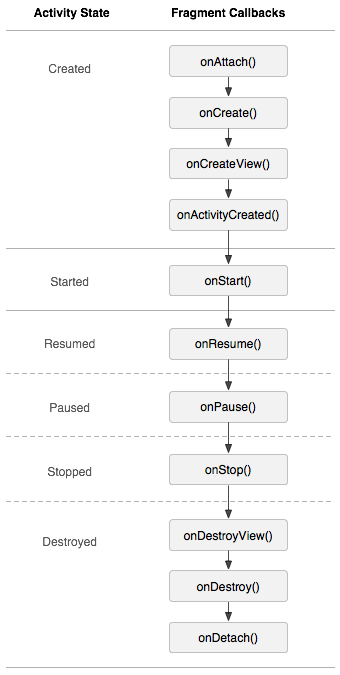

# Markdown

Created: 2020-01-03
Modified: 2020-01-03

* [Introduction](#intro)
* [Define a fragment](#define-fragment)
* [Lifecycle](#lifecycle)
* [FragmentManager](#fragment-manager)
* [References](#reference)
***
### <a id="intro">I. Introduction</a>

* Fragment is kind of a sub-activity that reside within a regular Activity class.
* A fragment can has its own layout and its lifecycle is bound to the parent activity.
* An activity can have multiple fragments, and a fragment can be reused in multiple activities.
* Fragment is introduced since Android 3.0 (API Level 11)
* <span style="color:red">A fragment has its own child fragments</span>

#### Attention
* <span style="color:red">Fragment is not natively supported by Framework API since API level 28. Original, Fragment class is original defined in Framework API, and the `Activity` class has a `FragmentController` (deprecated) to manage fragment. But it has been moved to androidx.</span> 

Instead, fragment is implemented by the support library/androidx `androidx.fragment.app.FragmentActivity` and `androidx.fragment.app.Fragment` [reference](https://developer.android.com/reference/androidx/fragment/app/Fragment)

* Even though it's syntactically possible to add <span style="color:red">a single fragment instance</span> to multiple container, it will cause exception.
```Java
        Fragment fragment = new MyFragment();
        FragmentManager fragmentManager = getSupportFragmentManager();
        FragmentTransaction fragmentTransaction = fragmentManager.beginTransaction();
        fragmentTransaction.add(R.id.c2, fragment);
        fragmentTransaction.add(R.id.c1, fragment);
        fragmentTransaction.commit();
```

```
Activity{
    Fragment{
        View ------- (e.g. LinearLayout, FrameLayout)
    }              |  
    ViewGroup{     | 
        View       |
        View       |
          <--------|
    }
}
```

```Java
android.app.Activity
    androidx.activity.ComponentActivity
        androidx.fragment.app.FragmentActivity
            androidx.appcompat.app.AppCompatActivity
```

#### Important method within FragmentActivity

* `public FragmentManager getSupportFragmentManager ()`, return a fragment manager that associated with the activity, which is used to create transaction where application code can add and delete fragments at runtime.

#### Use case of fragment
1. A tablet has a large screen will has multi-pane inside an activity. In this case, each panel is a fragment.
2. An app may have a bottom navigation bar, and content (fragment) will be updated when the user navigates to another content.


### <a id="define-fragment">II. Define a fragment</a>

`Fragment` class is the base class for creating fragments. It defines/provides
* Lifecycle methods
* Layout inflater
* Get parent activity

```Java
public class MyFragment extends Fragment {
    public Fragment2() {}

    @Override
    public View onCreateView(LayoutInflater inflater, ViewGroup container,
                             Bundle savedInstanceState) {
        // Inflate the layout for this fragment
        return inflater.inflate(R.layout.fragment_fragment2, container, false);
    }
}
```

1. `Fragment` class defines two constructor
* Default constructor: invoked when the fragment is initiated from activity's XML.
* `Fragment(int contentLayoutId)` provides a layout resource id used when `onCreateView`. Application code can invoked this constructor when initiating fragment by code.

### <a id="add-fragment">Lifecycle</a>

1. Add fragment by XML

```XML
<!--activity layout-->
<LinearLayout>
    <fragment 
        android:id="@+id/fragment1"
        android:layout_width="match_parent"
        android:layout_height="100dp"
        android:name="com.example.myapplication.fragments.MyFragment"/>
    <fragment 
        android:id="@+id/fragment2"
        android:layout_width="match_parent"
        android:layout_height="100dp"
        android:name="com.example.myapplication.fragments.MyFragment"/>
</LinearLayout>
```

In the above example, two fragments are initiated based on the same fragment. In addition, the fragment is kind like a custom view (e.g. `compound view`) that it can have `layout_width` and `layout_height`. 

XML based fragment will be created as the activity created. And the lifecycle of the fragment is bound to the activity as following:

2. Lifecycle: Fragment's lifecycle is bound to the container (parent) activity. In addition, activity can also explicitly control the fragment's lifecycle.
<p>
    
    
</p>

[reference](https://developer.android.com/guide/components/fragments#Lifecycle)

* OnCreate
    * activity.onCreate 
    * fragment constructor: at this point, the fragment doesn't has the parent activity yet.
    * fragment.onAttach: once attach, calling `getContext()` and `getActivity()` will return the context and activity. But the activity will not be fully initiated.
    * fragment.onCreate: 
    * fragment.onCreateView: creating and return the fragment's view. Usually, invoke `inflater.inflate` based on a XML layout.
    * fragment.onActivityCreated: retrieving view instance by id. e.g. seting LayoutParams for the fragment. At this point, activity is fully initiated.

* OnStart:
    * fragment.onStart: called when the fragment is visible to the user. <span style="color:red">visible definition?</span>
    * activity.onStart:

* OnResume:
    * activity.onResume:
    * fragment.onResume: user can begin interaction.

* OnPause:
    * fragment.onPause:
    * activity.onPause:

* OnStop:
    * fragment.onStop:
    * activity.onStop:

* onRestart:
    * activity.onRestart

* OnDestroy:
    * fragment.onDestroyView: called when the layout attached into the fragment has been detached. After this, you cannot access views.
    * fragment.onDestroy
    * fragment.onDetach: called when the fragment detached from container activity.
    * activity.onDestroy


### <a id="fragment-manager">III. FragmentManager</a>

A fragment can be created/removed/replaced by `FragmentManager` at runtime, for example
```Java
    public void addFragment(){
        Log.d(TAG, "addFragment");
        fragment = new MyFragment();
        FragmentManager fragmentManager = getSupportFragmentManager();
        FragmentTransaction fragmentTransaction = fragmentManager.beginTransaction();
        fragmentTransaction.add(R.id.main_container_id, fragment); 
        // add the fragment instance to the container. Of course, the container id must exist in the activity's layout file.
        // can't add a fragment to another activity's layout. 
        fragmentTransaction.commit();
        Log.d(TAG, "addFragment done");
    }

    public void removeFragment(){
        Log.d(TAG, "removeFragment");
        FragmentManager fragmentManager = getSupportFragmentManager();
        FragmentTransaction fragmentTransaction = fragmentManager.beginTransaction();
        fragmentTransaction.remove(fragment);
        fragmentTransaction.commit();
        Log.d(TAG, "removeFragment done");
    }
```

<span style="color:red">The earliest time that the function can be invoked when `onCreate` is invoked.</span> It can even be invoked beforce calling `setContentView`.

The lifecycle of a fragment is bound to the activity and triggered after `.commit()`. 
```
"addFragment" -> default constructor -> "addFragment done" -> onAttach -> onCreate -> ...

"removeFragment" -> "removeFragment done" -> onPause -> onStop -> onDestroyView -> onDestroy -> onDetach

new.onAttach -> new.onCreate -> old.onPause -> old.Stop -> old.onDestroyView -> old.onDestroy -> old.onDetach -> new.onActivityCreated -> new.onStart -> new.onResume.
```

#### FragmentTransaction


### <a id="reference">IV. References</a>
1. <a href="https://guides.github.com/features/mastering-markdown/" target="_blank">Mastering Markdown</a>