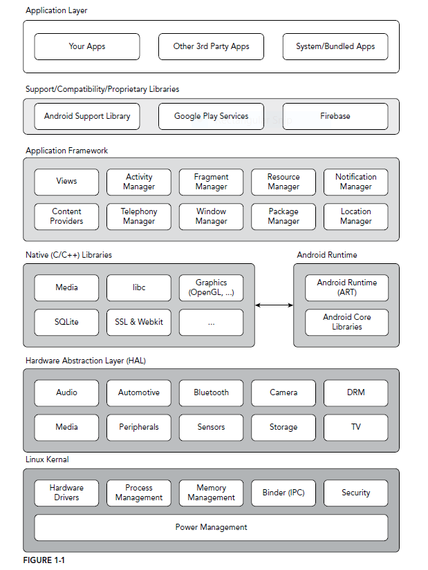

Created: 2020-01-03
Modified: 2020-01-04

* [Introduction](#intro)
* [Development Tools](#tools)
* [System Architecture](#architecture)
* [SDK](#sdk)
* [Manifest](#manifest)
* [References](#reference)
***
### <a id="intro">I. Introduction</a>
Android was initial released in September 2008, and acquired by Google in 2005. The current (Jan, 2020) version of Android is version 10.

Android was based on a modified version of Linux Kernel. Android applications are written in Java (and Kotlin) that run in ART (Android runtime), a modified version of JVM. (Originally, the runtime is Dalvik virtual machine)

ART...


Logo (2007 - 2014)


Logo (2014 - present)


### <a id="tools">II. Development Tools</a>

Android provides a compreshensive tool set for developing android applications, which contains developing, building, debuging, and testing.

1. Android Studio

Android Studio is an IDE for developing android application using either Java or Kotlin. Android Studio is based on Intellij IDEA and developed by JetBrains.

Code structure
```
/Application
    Application.iml // IDE file
    gradle settings
    build files
    .gitignore
    /gradle/wrapper
        wrapper files
    
    /app
        app.iml
        .gitignore
        /libs
        /build
            /generated
                /
        /src
            /test
            /androidTest
            /main
                AndroidManifest.xml
                /res
                    /drawable
                    /drawable-v24
                    /layout
                    ...
                /java/package.../code...

```


2. AVD Manager (Android Virtual Device)

AVD manager can create and run virtual devices (emulator) with pre-defined and customized profiles so that developers can test apps without having a physical android device. (AVD is integrated into Android Studio.)

3. Android Profiler

A tool for monitoring APP preformance. It can tells cpu, memory, and network usage.

4. Android Debug Bridge

Android debugger will insert break point into the code. When the coding is running, it will stop when hit the break point instruction.

### <a id="architecture">III. System Architecture</a>



At the top layer, each android app lives in its own security sandbox.

>1. The Android operating system is a multi-user Linux system in which each app is a different user.
>
>2. By default, the system assigns each app a unique Linux user ID (the ID is used only by the system and is unknown to the app). The system sets permissions for all the files in an app so that only the user ID assigned to that app can access them.
>
>3. Each process has its own virtual machine (VM), so an app's code runs in isolation from other apps.
>
>4. By default, every app runs in its own Linux process. The Android system starts the process when any of the app's components need to be executed, and then shuts down the process when it's no longer needed or when the system must recover memory for other apps.


### <a id="sdk">IV. SDK</a>

Each Android version brings not only new features for Android users but also a new set of Framework API for Android developers. For example, 

*Android 10 -> API level 29 ; Android 9 -> API level 28 ; Android 8.1 -> API level 27 ; Android 8.0 -> API level 26*

Android API are backward compatible. When starting developing an app, select the API level as low as possible so that the app can support more device.

#### Framework API

Framework API contains not only functions, but also XML elements, intents, and permissions that apps can request. The framework API is bound to the Android OS. When the user upgrade its Android system, the framework API is also updated to a new version. Developer can only use the framework API but not be able to control its version.

* [source code repo](https://android.googlesource.com/platform/frameworks/base.git)
* [source code github mirror](https://github.com/aosp-mirror/platform_frameworks_base)

#### Android Support Library & AndroidX.

Because android devices can have different version of Framework API, directly using framework API will bring compatibilty issue. Android provides a library layer on top of the Framework API to eliminate the compatibility issue. So developers can import and use this library instead of directly using Framework API.

AndroidX is a refactor of Android Support Library, which is introduced along with Android 9.0 (API level 28). Android Support Library is no longer maintained.

* [API reference](https://developer.android.com/reference/)
* [Source code](https://android.googlesource.com/platform/frameworks/support/)


### <a id="manifest">V. Manifest</a>

Each Android project has an associated manifest file (AndroidManifest.xml) that specifies app name, components of the app, permission, framework API requirement.
```XML
<?xml version="1.0" encoding="utf-8"?>
<manifest xmlns:android="http://schemas.android.com/apk/res/android"
    package="com.example.myapplication">
    <uses-sdk android:minSdkVersion="21"
          android:targetSdkVersion="28"
          android:maxSdkVersion="29" />

</manifest>

```

1. uses-sdk: designate the minimum required sdk and target sdk.

It's not practical max sdk version since the app may not be able to run after the user update the system to a higher version.
E.g. An app with max sdk version of 21 (Android 5.0) will be removed after the user upgrade system to Android 6.0.

Always selecting the minimium required SDK so that your app can be installed in most devices. In addition, Android Apps are forward-compatible, meaning
an app that is developed for API Level 21 will also run for API Level 22.

Target SDK version: by default, its value is same as the min sdk version.

2. application tag set icon, label, permissions. It also register the app's components inside.
* android:icon="@mipmap/ic_launcher", set icon
* android:roundIcon="drawable resource"
* android:label="string resource", set application's name displayed to the user.


### <a id="reference">VI. References</a>
1. <a href="https://developer.android.com/guide/components/fundamentals" target="_blank">Application Fundamentals</a>
2. Professional Android 4th Edition, Reto Meier & Ian Lake
3. <a href="http://www.dre.vanderbilt.edu/~schmidt/android/android-4.0/out/target/common/docs/doc-comment-check/guide/appendix/api-levels.html" target="_blank">Android API Levels</a>
4. <a href="https://developer.android.com/guide/topics/manifest/uses-sdk-element#ApiLevels" target="_blank">What is API Level?</a>