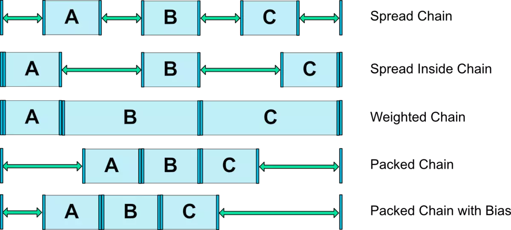
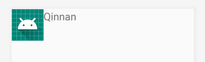

Created: 2020-01-06
Modified: 2020-01-06

* [Introduction](#intro)
* [Layout](#layout)
* [Modified Layout at runtime](#runtime)
* [Compound View](#compound)
* [References](#reference)
***
### <a id="intro">I. Introduction</a>

Android provides a couple of layout styles, LinearLayout (Framework API), RelativeLayout (Framework API), and ConstraintLayout (AndroidX).

1. LinearLayout layouts all views in either horizontal or vertical direction, it can "center" child views.
2. RelativeLayout
3. ConstraintLayout layouts all views by constraints. If the view's layout_width/height is set to '0dp' (match_constraint), then the constraintLayout can stretch the size of the view. (In constrast, RelativeLayout and LinearLayout cannot change its child views' size)

### <a id="layout">II. Layout</a>

#### 1. LinearLayout

LinearLayout arranges views either horizontally or vertically. It has XML attributes

* orientation: set horizontal or vertical
* gravity: control how views should be positioned within the layout.
* weightSum: along with `LayoutParams`'s `layout_weight` to control how to divide the vertical or horizontal space when the orientation is vertical or horizontal, respective.


It also has a inner class `LinearLayout.LayoutParams` that defines `layout_gravity` and `layout_weight`. 
```XML
<LinearLayout xmlns:android="http://schemas.android.com/apk/res/android"
    android:layout_width="match_parent"
    android:layout_height="match_parent"
    android:orientation="vertical" >
</LinearLayout>
```

#### 2. ConstraintLayout
ConstraintLayout bind a view's position to another view or the parent constraint layout. It also help center views, stretch views (by weights),
```XML
    <Button
        android:id="@+id/digit_1"
        android:layout_width="0dp"
        android:layout_height="0dp"
        android:text="1"
        app:layout_constraintBottom_toTopOf="@+id/digit_0"
        app:layout_constraintEnd_toStartOf="@+id/digit_2"
        app:layout_constraintStart_toStartOf="parent"
        app:layout_constraintTop_toBottomOf="@+id/digit_4"
        app:layout_constraintHorizontal_bias="0.5"
        app:layout_constraintHorizontal_chainStyle="spread"
         />
```

* The above example layout the button accroding to parent and other 3 around view. Its width and height are set to 0dp (match_constraint) so it will be stretched to reach the constraint.
* horizontal bias is effective when the horizontal size (width) is an exact number or wrap content. In this case, the left and right constraint will "apply equal force" to poll the view, and the view will locate at the center. The default value of bias is 0.5, meaning left and right apply the same "force".
A bais = 0.75 will make the right force stronger than the right force, so the view will be location at right a little bit.

* chain style `layout_constraintHorizontal/Vertical_chainStyle` is used to control how a group of views are horizontally/veritcally distributed. When using chainstyle, bais will lose effect. It has three values, `packed`, `spread`, `spread_inside`.
    * When view size are not `match_constraint`, 
        * `pack` will center all views together, it also provides `layout_constraintHorizontal/Vertical_bias` to shift the center.
        * `spread` will distribute views equally, 
        * `spread_inside` will distribute the two terminal views to parent and evenly distribute other views. 
    * When view size is `match_constraint`, chain style are not necessary because all the effect is to stretch views and evenly distribute them. <span style="color:red">In this case, `constraintLayout` provides each view a weight to control the stretch degree.</span>

<p></p>

```XML
<Button
    android:layout_width="0dp"
    app:layout_constraintHorizontal_chainStyle="spread"
    app:layout_constraintHorizontal_weight="1"
>
<Button
    android:layout_width="0dp"
    app:layout_constraintHorizontal_weight="2"
>
```
The second button's width is twice large as the first button.


#### 3. RelativeLayout

Same as `ConstraintLayout`, `RelativeLayout` position views accroding to its parent and other views. When a view doesn't any `position` attribute, it will position the view at the top left corner.

* align a view top/bottom/left/right/start/end edge to any view's corresponding <span style="color:red">same</span> edge.
```
android:layout_alignBottom="@id/movie_image_id"
```
* position a view's start edge to another view's end edge.
```
android:layout_toEndOf="@+id/movie_image_id"
```
* position a view align with its parent, e.g. the following position the top edge to the top of parent.
```
android:layout_alignParentTop="true"
```

In code, `RelativeLayout` primarily uses `.addRule` to add position contraints. For example,
```Java
        RelativeLayout.LayoutParams ivLayoutParams = (RelativeLayout.LayoutParams)iv.getLayoutParams();
        RelativeLayout.LayoutParams tvLayoutParams = (RelativeLayout.LayoutParams)tv.getLayoutParams();
        ivLayoutParams.width = LayoutParams.WRAP_CONTENT;
        ivLayoutParams.height = LayoutParams.WRAP_CONTENT;
        ivLayoutParams.addRule(RelativeLayout.ALIGN_PARENT_TOP, RelativeLayout.TRUE);
        ivLayoutParams.addRule(RelativeLayout.ALIGN_PARENT_START, RelativeLayout.TRUE);

        tvLayoutParams.width = LayoutParams.WRAP_CONTENT;
        tvLayoutParams.height = LayoutParams.WRAP_CONTENT;
        tvLayoutParams.addRule(RelativeLayout.END_OF, R.id.movie_image);
        tvLayoutParams.addRule(RelativeLayout.ALIGN_BOTTOM, R.id.movie_image);
        tvLayoutParams.addRule(RelativeLayout.ALIGN_PARENT_TOP, RelativeLayout.TRUE);
        tvLayoutParams.addRule(RelativeLayout.ALIGN_PARENT_END, RelativeLayout.TRUE);

        iv.setLayoutParams(ivLayoutParams);
        tv.setLayoutParams(tvLayoutParams);
```
<p></p>


<span style="color:red">The view's layout_width/height will be ignored when the position attributes has to resize it.</span>

#### 4. FrameLayout


### <a id="runtime">III. Modified Layout at runtime</a>

1. `getLayoutParams()` and `setLayoutParams(ViewGroup.LayoutParams)` are used on a view to tell its parent how it wants to be layouted.
```java
// get layout parameter
// get a layout parameter and convert it to the linearlayout parameters.
LinearLayout.LayoutParams btn1LayoutParams = new LinearLayout.LayoutParams(btn1.getLayoutParams());
// If the view container is linearlayout, then we can cast
btn1LayoutParams = (LinearLayout.LayoutParams) btn1.getLayoutParams();
```

2. get child view's layout parameter and modified them will not automatically re-layout the view. Instead, must call `requestlayout` prvoided by the view group. The ViewGroup will re-layout the view tree
```java
btn1LayoutParams.weight = 0.5f;
btn1LayoutParams.width = LinearLayout.LayoutParams.MATCH_PARENT;
btn1.setLayoutParams(btn1LayoutParams);
mainLayout.requestLayout();
```

How the view tree
```java
/**
* <linearlayout main>
*   <linearlayout layout1>
*       <button b1>
*       <button b2>
*   </linearlayout>
*   <linearlayout layout2>
*       <button b3>
*       <button b4>
*   </linearlayout>
* </linearlayout>
*
*/

btn1.getLayoutParams().width = LinearLayout.LayoutParams.MATCH_PARENT;
btn3.getLayoutParams().width = LinearLayout.LayoutParams.MATCH_PARENT;
layout1.getLayoutParams().height = LinearLayout.LayoutParams.WRAP_CONTENT;
```

* Calling `mainLayout.requestLayout` makes `layout1` and `btn1` settings be effective.
* Calling `layout1.requestLayout` makes `layout1` and `btn1` settings be effective.
* Calling `layout2.requestLayout` makes `layout1`, `btn1` and `btn2` settings be effective.

`requestLayout` method will marks this view as `Force_layout`

```Java
mPrivateFlags |= PFLAG_FORCE_LAYOUT;
mPrivateFlags |= PFLAG_INVALIDATED;
mParent.requestLayout();
```

and invokes its parent requestLayout until hit the top layer, which is `ViewRootImpl`.
The `ViewRootImpl` will schedule a view tree traverse.


### <a id="compound-view">IV. Compound Views</a>

1. create a view class that inherit from another view, usually, it's a layout class.
2. define a `<declare-stylable>` that includes custom view's attributes.
3. create the view's layout in the XML file.
4. access its attribute values within the class, and set the compound views inner view priority.


#### using the compound views
Use it as a normal view by supplying these attribute. 


### <a id="reference">References</a>
